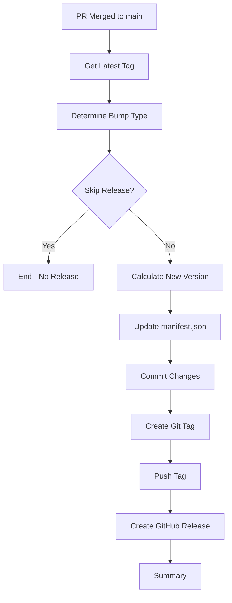

# Auto Tag and Version Bump Guide

## Overview

The Auto Tag workflow automatically creates new git tags and bumps the version when a Pull Request is merged to `main`.

## How It Works

### Trigger

The workflow runs when:
- A Pull Request is **merged** (not just closed)
- The target branch is `main`

### Process

```
PR Merged → Detect Version Bump Type → Calculate New Version → Update manifest.json → Create Tag → Create Release
```

## Version Bump Detection

The workflow determines the version bump type (major, minor, patch) based on:

### 1. PR Title Keywords (Highest Priority)

**Major Version Bump** (1.0.0 → 2.0.0)
- `[major]` prefix: `[major] Redesign API structure`
- `major:` prefix: `major: Breaking changes to config`
- Contains: `breaking change` or `BREAKING CHANGE`

**Minor Version Bump** (1.0.0 → 1.1.0)
- `[minor]` prefix: `[minor] Add new sensor`
- `minor:` prefix: `minor: Add weather alerts`
- `feature:` prefix: `feature: New forecast display`
- `feat:` prefix: `feat: Add wind gust support`

**Patch Version Bump** (1.0.0 → 1.0.1) - Default
- `[patch]` prefix: `[patch] Fix temperature parsing`
- `patch:` prefix: `patch: Fix cache expiry`
- `fix:` prefix: `fix: Correct geocode detection`
- `bugfix:` prefix: `bugfix: Handle API timeout`
- Any other title defaults to patch

### 2. PR Labels (If no title keyword)

**Major Bump:**
- Label: `breaking`

**Minor Bump:**
- Label: `feature` or `enhancement`

**Patch Bump:**
- Label: `bug`, `bugfix`, or `fix`

### 3. Skip Release

To skip creating a tag/release:
- Add label: `skip-release` or `no-release`

## Examples

### Example 1: Major Version Bump

**PR Title:** `[major] Redesign API to use v2 endpoints`

**Result:**
- Current: `v1.2.3`
- New: `v2.0.0`
- Resets minor and patch to 0

### Example 2: Minor Version Bump

**PR Title:** `feat: Add support for weather alerts`

**Result:**
- Current: `v1.2.3`
- New: `v1.3.0`
- Resets patch to 0

### Example 3: Patch Version Bump

**PR Title:** `fix: Correct temperature unit conversion`

**Result:**
- Current: `v1.2.3`
- New: `v1.2.4`

### Example 4: Using Labels

**PR Title:** `Update geocode cache logic`
**Labels:** `enhancement`

**Result:**
- Current: `v1.2.3`
- New: `v1.3.0` (minor bump from enhancement label)

### Example 5: Skip Release

**PR Title:** `docs: Update README`
**Labels:** `skip-release`

**Result:**
- No tag created
- No release created
- manifest.json not updated

## What Gets Updated

### 1. manifest.json

```json
{
  "version": "1.2.4"  ← Updated automatically
}
```

### 2. Git Tag

```bash
git tag -a v1.2.4 -m "Release v1.2.4..."
```

### 3. GitHub Release

- **Tag:** `v1.2.4`
- **Title:** `Release v1.2.4`
- **Body:**
  - PR number and title
  - PR author
  - PR description
  - Commit list

## Workflow Steps



## PR Title Best Practices

### Conventional Commits Style

Use conventional commit format for clarity:

```
<type>[optional scope]: <description>

[optional body]

[optional footer]
```

**Types:**
- `feat:` - New feature (minor bump)
- `fix:` - Bug fix (patch bump)
- `docs:` - Documentation only (use skip-release label)
- `style:` - Code style changes (use skip-release label)
- `refactor:` - Code refactoring (patch or minor)
- `test:` - Adding tests (use skip-release label)
- `chore:` - Maintenance (use skip-release label)

**Examples:**
```
feat: Add weather alerts support
fix: Correct geocode cache expiry
docs: Update installation instructions
chore: Update dependencies
```

### Breaking Changes

For breaking changes, use one of:

```
[major] Complete API redesign
major: Change config structure (breaking)
feat!: New API (BREAKING CHANGE)
```

Or add in PR body:
```
BREAKING CHANGE: The config format has changed.
Users need to update their configuration.
```

## Labels to Use

Create these labels in your GitHub repository:

### Version Bump Labels
- `breaking` - Major version bump
- `feature` - Minor version bump
- `enhancement` - Minor version bump
- `bug` - Patch version bump
- `bugfix` - Patch version bump
- `fix` - Patch version bump

### Control Labels
- `skip-release` - Don't create tag/release
- `no-release` - Don't create tag/release

### Other Useful Labels
- `documentation` - Docs only (add skip-release)
- `dependencies` - Dependency updates (patch)
- `security` - Security fixes (patch or minor)

## Manual Override

If the automatic versioning doesn't work as expected, you can:

### Option 1: Delete and Recreate Tag

```bash
# Delete local and remote tag
git tag -d v1.2.4
git push origin :refs/tags/v1.2.4

# Create correct tag
git tag -a v1.3.0 -m "Release v1.3.0"
git push origin v1.3.0

# Update manifest.json manually
# Then commit and push
```

### Option 2: Create Tag Before Merge

```bash
# On main branch, after PR is merged
git tag -a v1.3.0 -m "Release v1.3.0"
git push origin v1.3.0
```

The workflow will detect the existing tag and skip.

## Workflow Outputs

### GitHub Actions Summary

After successful run:

```
### 🎉 Auto Tag Complete!

- **New Version:** v1.2.4
- **Bump Type:** patch
- **PR:** #42
- **Author:** @username

✅ Tag created and pushed
✅ manifest.json updated
✅ GitHub Release created
```

### Git History

```bash
$ git log --oneline
abc1234 chore: bump version to v1.2.4
def5678 Merge pull request #42 from user/fix-bug
```

### Tags

```bash
$ git tag
v1.2.3
v1.2.4  ← New tag
```

## Troubleshooting

### Tag Already Exists

**Error:** `fatal: tag 'v1.2.4' already exists`

**Solution:**
1. Check if tag was manually created
2. Delete the tag if incorrect
3. Re-run workflow or create correct tag

### Version Mismatch

**Error:** Release workflow fails due to version mismatch

**Solution:**
The auto-tag workflow updates `manifest.json`, so the release workflow should pass. If not:
1. Check that auto-tag ran successfully
2. Verify `manifest.json` was updated
3. Ensure the tag version matches manifest

### No Tag Created

**Reasons:**
1. PR has `skip-release` label
2. PR was closed without merging
3. Workflow didn't run (check Actions tab)

**Solution:**
1. Check PR labels
2. Verify PR was merged
3. Check workflow logs in Actions tab

### Incorrect Version Bump

**Issue:** Wrong version bump type applied

**Solution:**
1. Use correct PR title format
2. Add appropriate labels
3. Or manually delete tag and recreate

## Configuration

### Customize Bump Detection

Edit `.github/workflows/auto-tag.yml`:

```yaml
- name: Determine version bump
  id: bump_type
  run: |
    # Modify these patterns:
    if echo "$PR_TITLE" | grep -iE 'your-pattern'; then
      BUMP="major"
    fi
```

### Change Branch

To trigger on different branch:

```yaml
on:
  pull_request:
    types: [closed]
    branches:
      - develop  # Change from 'main'
```

### Disable Auto-Release

To only create tags without GitHub releases, remove:

```yaml
- name: Create GitHub Release
  # ... remove this step
```

## Integration with Release Workflow

The auto-tag workflow works seamlessly with the existing release workflow:

1. **Auto-tag runs** → Creates tag `v1.2.4`
2. **Release workflow triggers** → Detects new tag
3. **Release workflow runs** → Validates, tests, creates ZIP

No manual intervention needed! 🎉

## Best Practices

### 1. Use Meaningful PR Titles

✅ Good:
```
feat: Add weather alerts for severe conditions
fix: Correct geocode detection for coastal cities
[major] Redesign API to use GraphQL
```

❌ Bad:
```
Update stuff
Fix bug
Changes
```

### 2. Add Labels

Always add at least one label:
- Feature PRs → `enhancement` label
- Bug fixes → `bug` label
- Docs → `documentation` + `skip-release`

### 3. Documentation PRs

For documentation-only changes:
```
Title: docs: Update installation guide
Labels: documentation, skip-release
```

### 4. Dependency Updates

For dependency updates:
```
Title: chore: Update dependencies
Labels: dependencies
(Defaults to patch bump)
```

### 5. Review Before Merge

Before merging PR:
1. ✅ Check PR title has correct prefix
2. ✅ Verify labels are appropriate
3. ✅ Confirm version bump will be correct
4. ✅ Add `skip-release` if no release needed

## Example Workflow

### Feature Development

1. **Create feature branch**
   ```bash
   git checkout -b feature/weather-alerts
   ```

2. **Develop feature**
   ```bash
   # Make changes
   git commit -m "Add weather alert sensors"
   ```

3. **Create PR**
   - Title: `feat: Add weather alerts support`
   - Labels: `enhancement`
   - Description: Explain the feature

4. **Merge PR**
   - PR is reviewed and approved
   - Merge to `main`

5. **Automatic tagging**
   - Workflow detects `feat:` prefix
   - Bumps minor version: `v1.2.3` → `v1.3.0`
   - Updates `manifest.json`
   - Creates tag `v1.3.0`
   - Creates GitHub release

6. **Release workflow runs**
   - Triggered by new tag
   - Runs tests
   - Creates ZIP file
   - Uploads to release

7. **Done!**
   - New version available
   - Users can update via HACS

## Summary

The auto-tag workflow:

✅ **Automatically creates tags** when PRs are merged
✅ **Bumps version intelligently** based on PR title/labels
✅ **Updates manifest.json** automatically
✅ **Creates GitHub releases** with changelog
✅ **Integrates with release workflow** seamlessly
✅ **Supports skip-release** for non-release PRs
✅ **Follows semantic versioning** (semver)

No manual version management needed! 🚀
